# Отчет по Лабораторной работе №3 " Анализ защищенности с использованием Kali Linux и Damn Vulnerable Linux (DVL)"

## Задание 1. Начальная настройка

Устанавливаем Kali и DVL. Определим IP на DVL

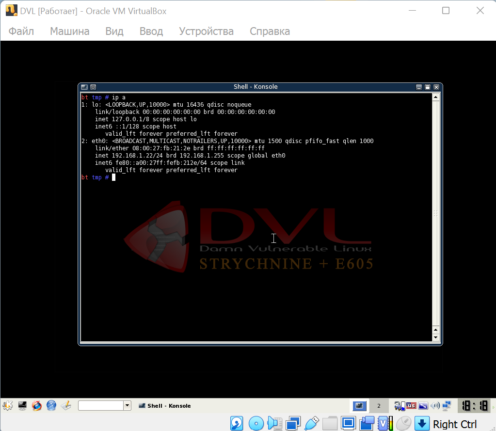

## Задание 2. Сканирование Сети и Уязвимостей

1. Nmap

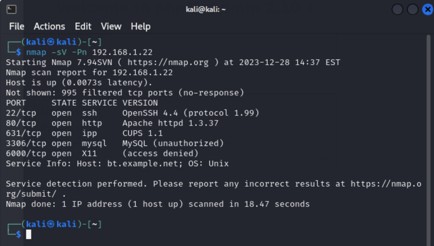

2. OpenVAS

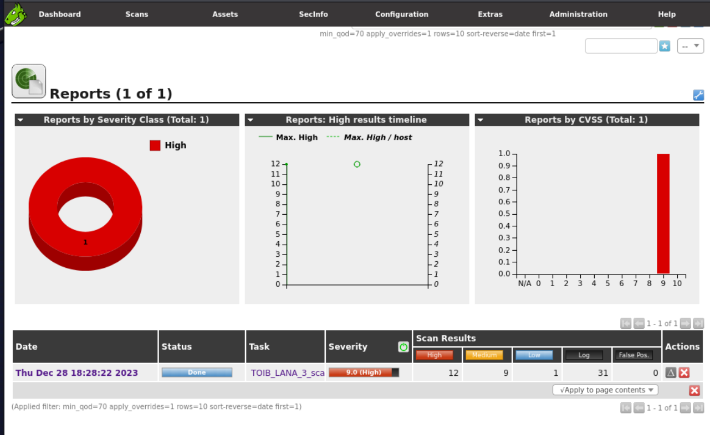

## Задание 3. Пентестинг Веб-Приложений
1. XSS 
Тестируем приложение

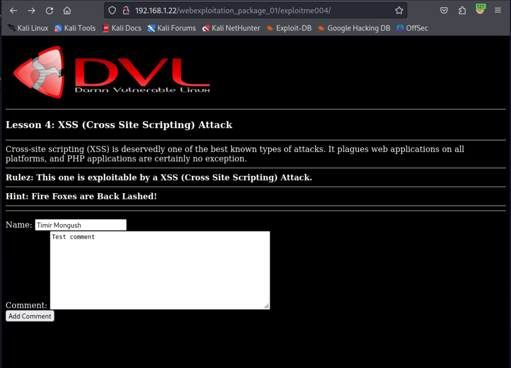

Перехватываем и меняем запрос

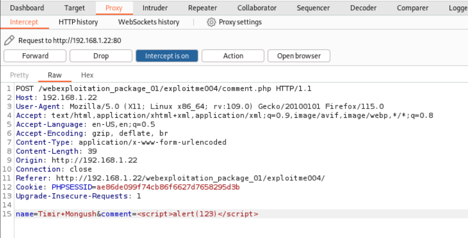

Успешное выполнение

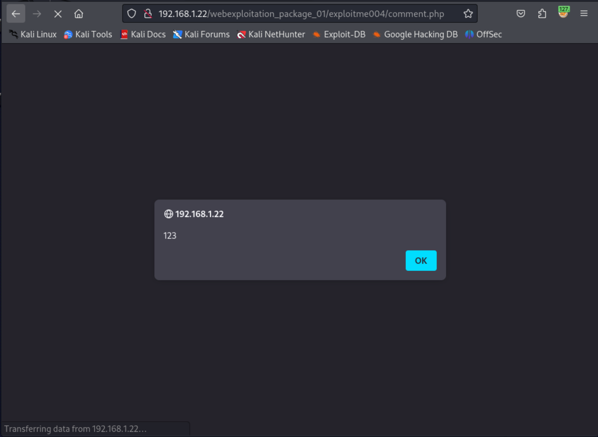

3. CSRF 
Тестируем приложение

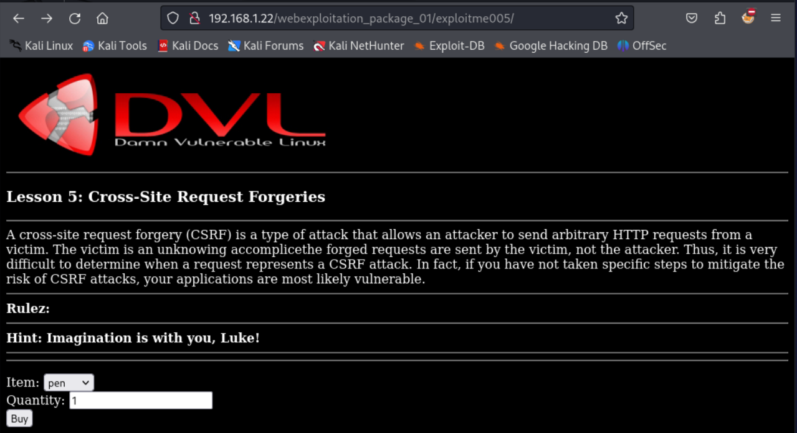

Перехватываем и меняем запрос

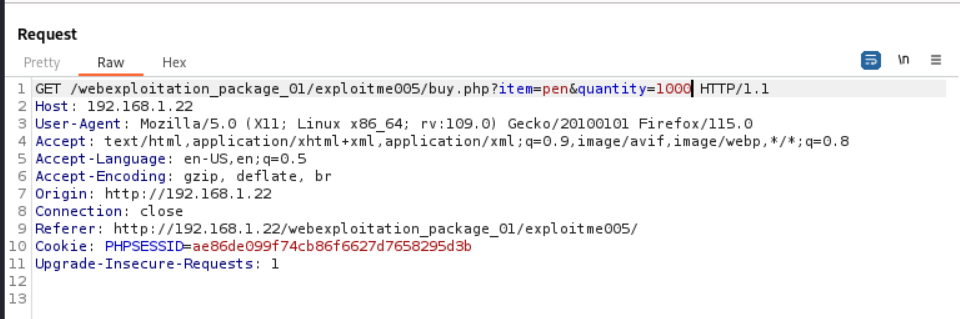

Успешное выполнение

## Задание 4. Анализ Безопасности Системы

1. Metasploit 
Задаем нужные параметры
 
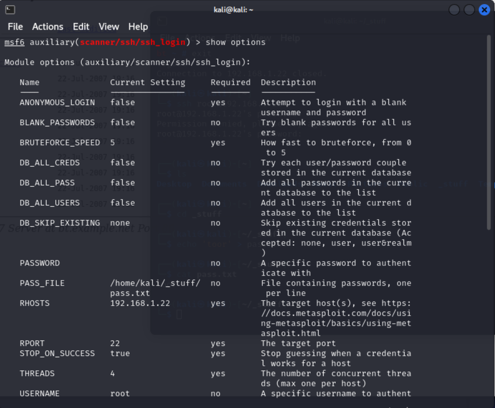

Получаем пароль root пользователя

2. JohnTheRipper 
С помощью найденного пароля заходим в SSH и подключаемся к MySQL - находим учетку
 
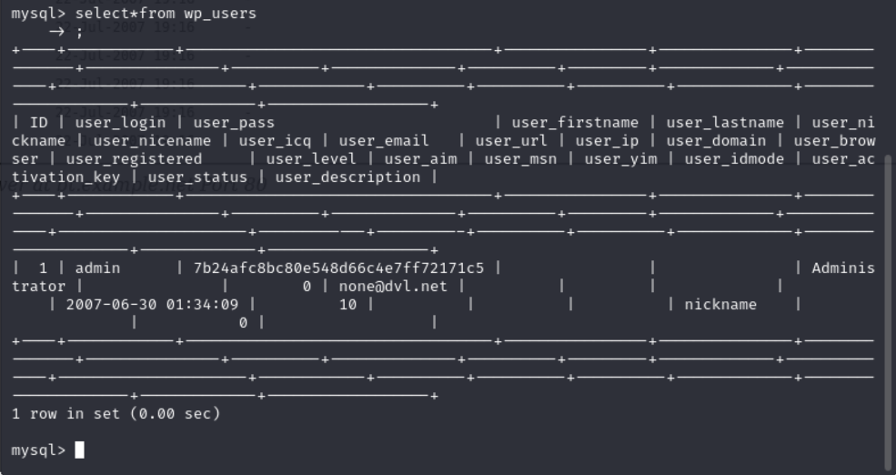

Ломаем пароль учетки "admin"

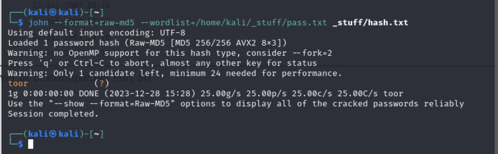

## Задание 5. Сетевая Защита и Защита От Вторжений

1. Wireshark 
Детект аномальных запросов

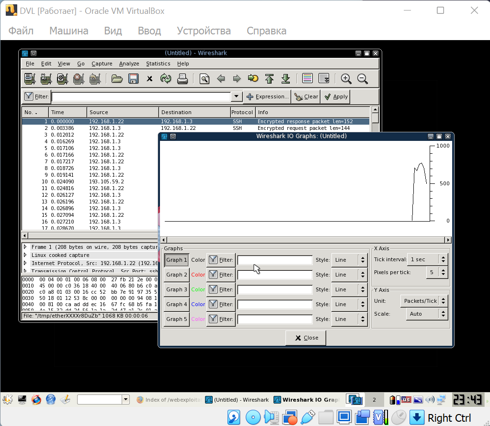

2. Snort 
Правила защиты

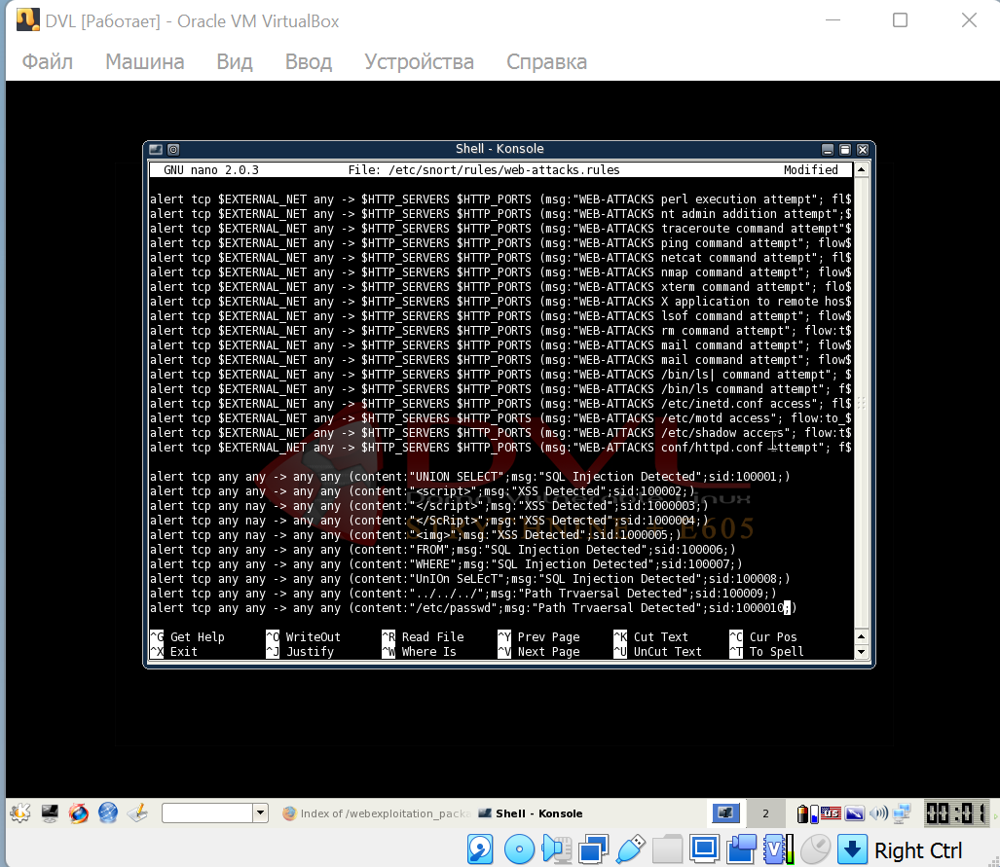
