# Отчет по Лабораторной работе №4 "Настройка и применение криптографических протоколов"

## Задание 1. Настройка GnuPG

1. Генерируем новые ключи с помощью gpg

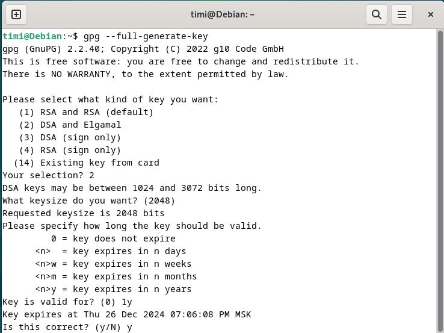
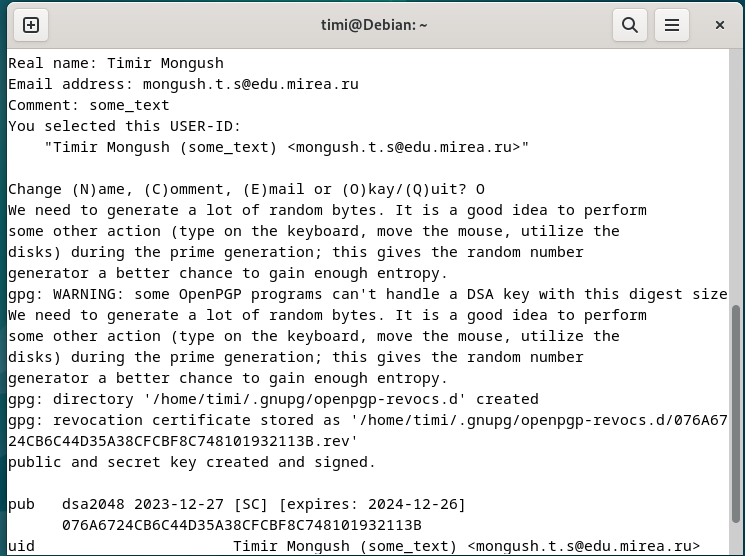

## Задание 2. Управление ключами
1. Просмотр созданных ключей, подписей и отпечатков

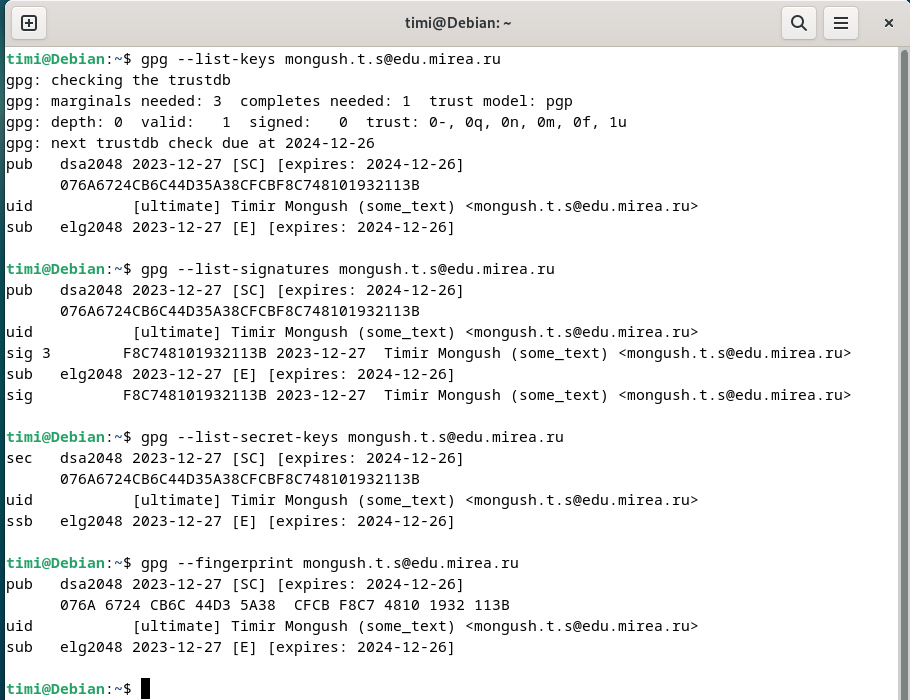

2. Создание отзывающего сертификата. Вывод в stdout и запись его в файл

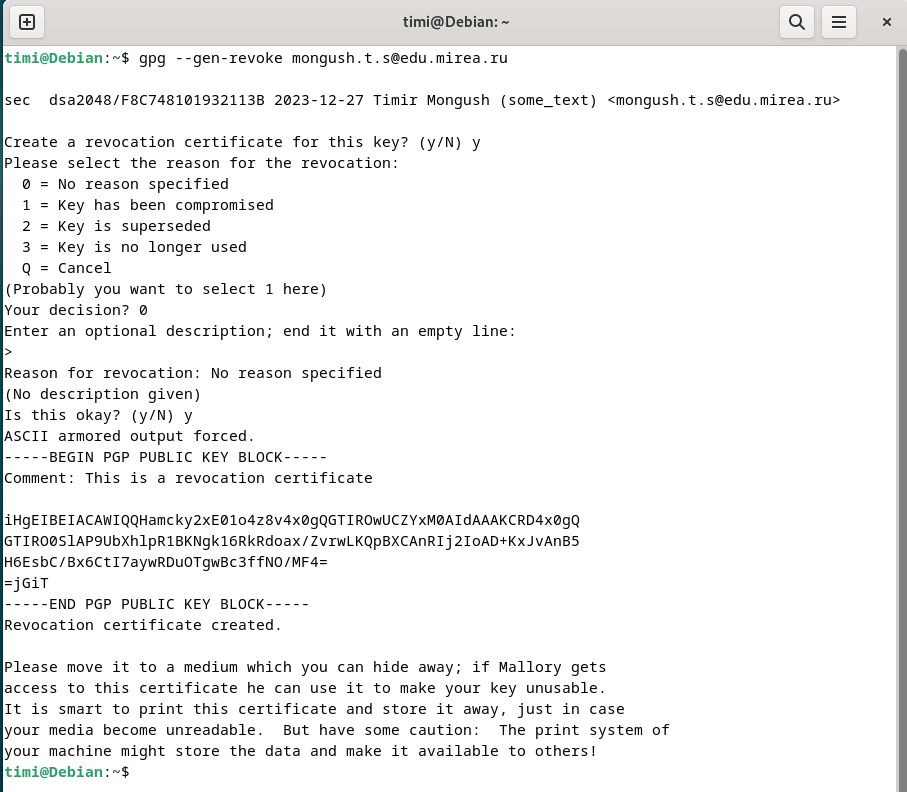
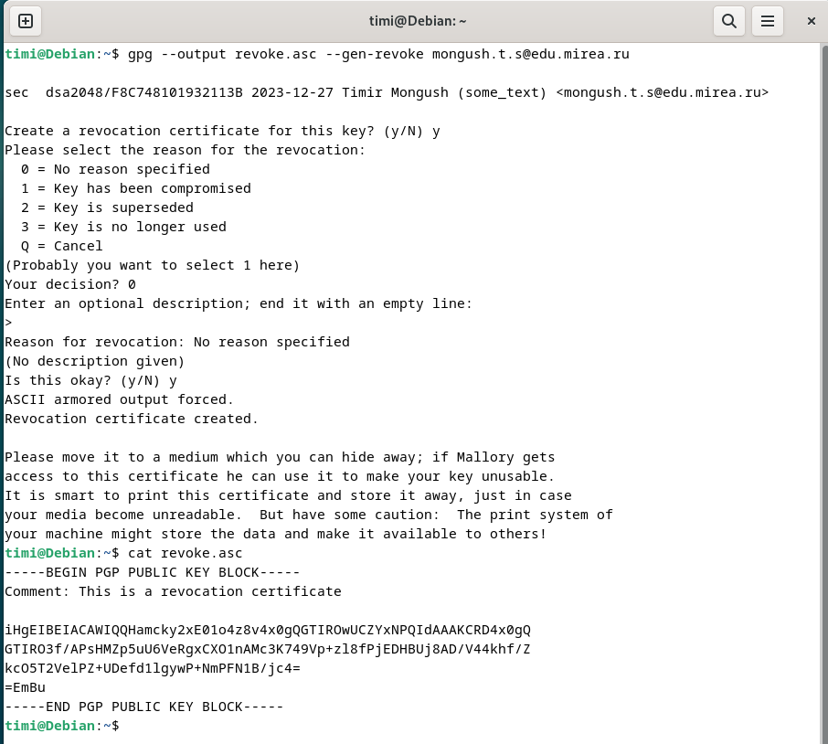

3. Экспортируем публичный ключ в бинарном и текстовом виде

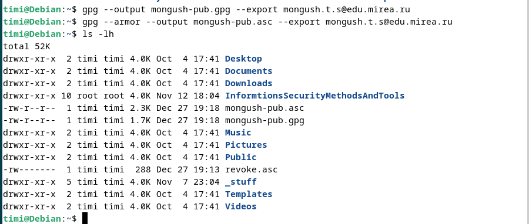
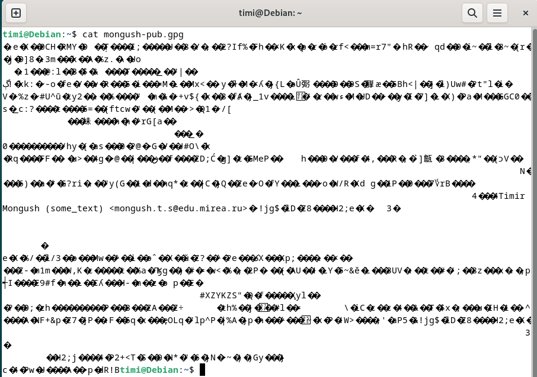
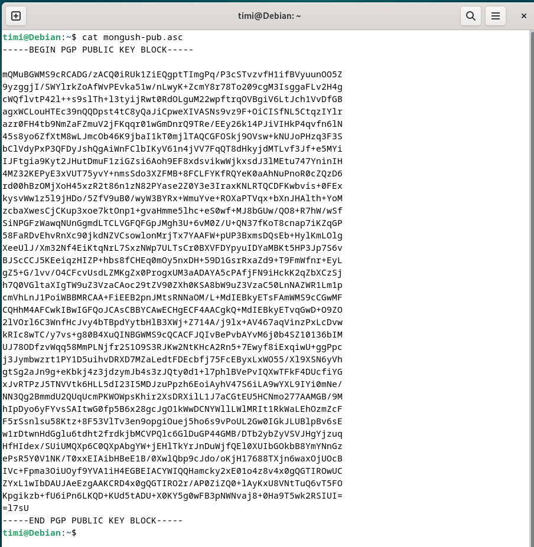

## Задание 3. Настройка цифровых подписей
1. Создаем файла для подписи

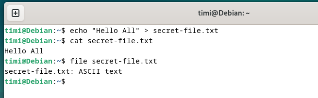

2. Подписываем файл в бинарном формате

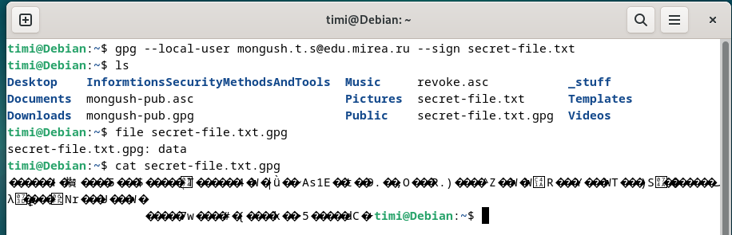

3. Проверяем подпись

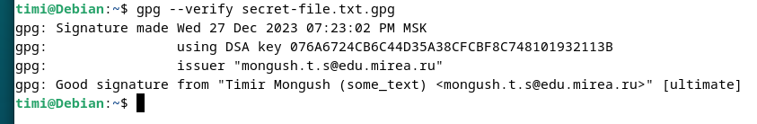

4. Создаем еще один файл и подписываем его в формате ASCII

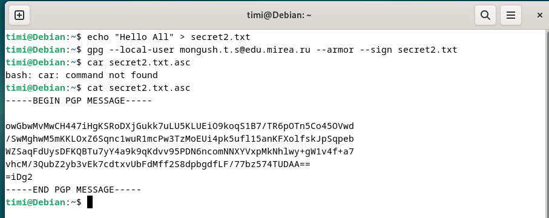

5. Создаем еще один файл и добавляем свою подпись к содержимому файла

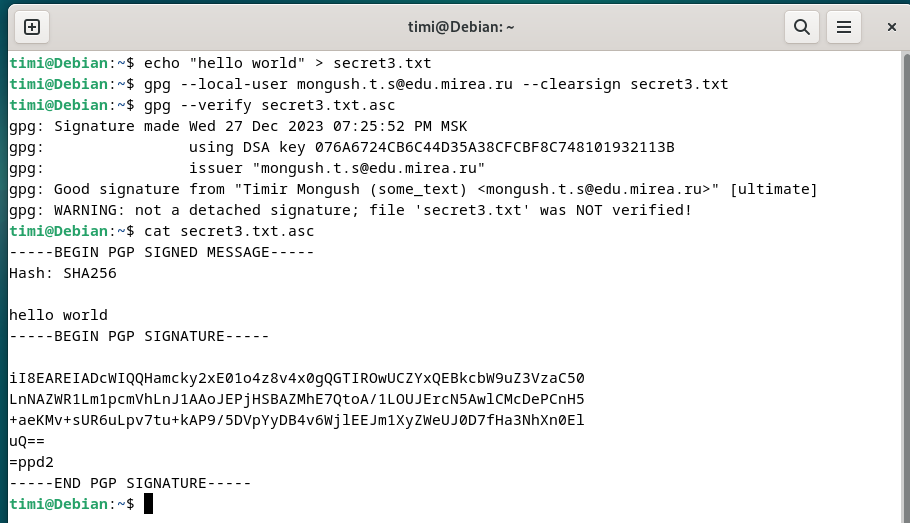
